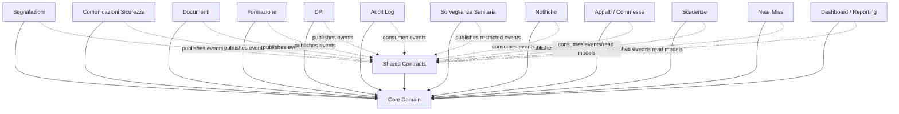

# Application Context LogosSafety

## Obiettivo

Questo documento definisce i confini architetturali dei moduli principali di LogosSafety.

Il Core Domain e la dipendenza condivisa e stabile. I moduli funzionali possono dipendere dal Core, ma il Core non puo dipendere dai moduli funzionali. La comunicazione tra moduli deve avvenire tramite contratti applicativi, port, eventi o API interne esplicite.

Questo documento non introduce nuove funzionalita, database, API, routing, UI o integrazioni runtime.

## 1. Mappa dei moduli

## Regole di dipendenza

Consentito:

- ogni modulo funzionale puo importare `app/src/modules/core/domain`;
- ogni modulo funzionale puo importare contratti tecnici da `app/src/modules/shared/contracts`;
- un modulo puo esporre port o API interne esplicite;
- Audit e Notifiche possono consumare eventi pubblicati dai moduli;
- Dashboard/Reporting puo leggere query dedicate o read model.

Vietato:

- il Core non importa moduli funzionali;
- un modulo funzionale non importa repository, tabelle Drizzle, mapper o aggregate interni di un altro modulo;
- nessun modulo accede direttamente alle tabelle private di un altro modulo;
- business logic non chiama direttamente Audit o Notifiche come dipendenza concreta;
- Dashboard/Reporting non duplica logiche di dominio operative;
- Comunicazioni Sicurezza non viene inglobato in Segnalazioni;
- Sorveglianza Sanitaria non espone dati clinici tramite eventi generici.

## 2. Schede modulo

### Core

- Scopo: linguaggio condiviso per tenant, persone, account, organizzazioni, ruoli, permessi e perimetri.
- Responsabilita: definire tipi e validazioni pure cross-module.
- Dati posseduti: nessun dato persistente in questo sprint; possiede i tipi concettuali.
- Entita principali: Tenant, Organization, Person, UserAccount, Membership, Role, Permission, RoleAssignment, OrganizationalScope, Site, Contract, Plant, Area.
- Use case principali: validare identita, perimetro e assignment.
- Dipendenze consentite: nessuna dipendenza da moduli funzionali.
- Dipendenze vietate: Drizzle, Hono, tRPC, React, Segnalazioni, Documenti, Audit, Notifiche e ogni modulo funzionale.
- Eventi pubblicati: nessuno.
- Eventi consumati: nessuno.
- Permessi principali: vocabolario `Permission`.
- Rischi: mapping futuro con ID legacy numerici.
- Roadmap: adapter legacy da users/workers/companies e matrice RBAC completa.

### Segnalazioni

- Scopo: gestire segnalazioni sicurezza, commenti, allegati, workflow e presa visione.
- Responsabilita: lifecycle della segnalazione e policy di visibilita/gestione.
- Dati posseduti: segnalazione, commento, allegato metadata, workflow event, acknowledgement della segnalazione.
- Entita principali: Segnalazione, Commento, Allegato, WorkflowEvento.
- Use case principali: crea, lista visibile, dettaglio, commenta, presa in carico, richiedi integrazione, integra, risolvi, chiudi, presa visione.
- Dipendenze consentite: Core, shared contracts, port repository, port audit/notifiche.
- Dipendenze vietate: repository Documenti, tabelle Comunicazioni, tabelle Audit, tabelle Notifiche.
- Eventi pubblicati: `segnalazioni.created`, `segnalazioni.status_changed`, `segnalazioni.comment_added`, `segnalazioni.closed`, `segnalazioni.acknowledged`.
- Eventi consumati: futuri eventi Core/account disattivato, scope aggiornato, documento allegato validato.
- Permessi principali: `segnalazioni.create`, `segnalazioni.view_own`, `segnalazioni.view_scope`, `segnalazioni.manage`, `segnalazioni.comment`, `segnalazioni.close`.
- Rischi: duplicazione temporanea di Role e OrganizationalScope rispetto al Core.
- Roadmap: adapter verso Core ActorContext e wiring backend unico LogosSafety.

### Comunicazioni Sicurezza

- Scopo: distribuire comunicazioni, video, circolari, infografiche e avvisi con presa visione.
- Responsabilita: pubblicazione, audience, scadenza presa visione e stato utente.
- Dati posseduti: comunicazione, audience, acknowledgement comunicazione, metadati contenuto.
- Entita principali: Comunicazione, CommunicationAudience, CommunicationAcknowledgement.
- Use case principali: pubblica, lista comunicazioni visibili, apri, registra presa visione, sollecita scadenze.
- Dipendenze consentite: Core, shared contracts, Documenti tramite port allegati, Audit/Notifiche via eventi.
- Dipendenze vietate: aggregate Segnalazione, repository Segnalazioni, tabelle private Segnalazioni.
- Eventi pubblicati: `comunicazioni.published`, `comunicazioni.viewed`, `comunicazioni.acknowledged`, `comunicazioni.expired`.
- Eventi consumati: documento disponibile, persona/account disattivato, scope aggiornato.
- Permessi principali: `comunicazioni.view`, `comunicazioni.acknowledge`, futuro `comunicazioni.manage`.
- Rischi: confusione funzionale con tab Comunicazioni dentro UI Segnalatore.
- Roadmap: estrarre modulo dedicato sotto `app/src/modules/comunicazioni`.

### Documenti

- Scopo: gestire metadati documentali, accesso e download sicuro.
- Responsabilita: ownership documento, classificazione, policy accesso, storage adapter.
- Dati posseduti: documento, classificazione, riferimenti storage, access log documentale.
- Entita principali: Documento, DocumentClass, DocumentAccessRequest.
- Use case principali: lista, carica metadata, apri, scarica, classifica, revoca accesso.
- Dipendenze consentite: Core, shared contracts, storage port, Audit/Notifiche via eventi.
- Dipendenze vietate: accesso diretto alle tabelle di Formazione, Sanitaria o Segnalazioni per decidere regole di dominio.
- Eventi pubblicati: `documenti.uploaded`, `documenti.accessed`, `documenti.deleted`, `documenti.classification_changed`.
- Eventi consumati: richiesta allegato da Segnalazioni/Comunicazioni tramite port esplicito.
- Permessi principali: `documenti.view`, `documenti.manage`.
- Rischi: dati sanitari e identita richiedono policy piu restrittive.
- Roadmap: storage privato con URL firmate e read model accessi.

### Audit Log

- Scopo: registrare eventi rilevanti e tracciabilita operativa.
- Responsabilita: persistenza audit, consultazione filtrata, immutabilita logica.
- Dati posseduti: `audit_log_entries`.
- Entita principali: AuditEntry, AuditEvent.
- Use case principali: registra evento, lista audit, filtra per modulo, utente, entita e data.
- Dipendenze consentite: Core, shared contracts, eventi pubblicati dai moduli.
- Dipendenze vietate: chiamate sincrone invasive dentro business logic, accesso diretto ai repository di dominio.
- Eventi pubblicati: `audit.recorded`.
- Eventi consumati: eventi di dominio da tutti i moduli.
- Permessi principali: `audit.view`.
- Rischi: router Audit legacy ancora basato su `audit_logs`.
- Roadmap: UI/query pubbliche per `audit_log_entries` e retention policy.

### Notifiche

- Scopo: orchestrare notifiche operative e solleciti.
- Responsabilita: outbox persistente, canali futuri, template futuri, stato invio e retry futuri.
- Dati posseduti: `notification_outbox`, notifica futura, delivery attempt futuro, preferenze canale future.
- Entita principali: NotificationOutboxEntry, Notification, NotificationDelivery.
- Use case principali: enqueue, trova pending, marca processing, marca processed, marca failed.
- Dipendenze consentite: Core, shared contracts, eventi di dominio.
- Dipendenze vietate: dipendenza diretta da repository dei moduli sorgente.
- Eventi pubblicati: `notifiche.scheduled`, `notifiche.sent`, `notifiche.failed`.
- Eventi consumati: eventi da Segnalazioni, Comunicazioni, Scadenze, Formazione, DPI, Sanitaria.
- Permessi principali: futuri `notifiche.view`, `notifiche.manage`.
- Rischi: nessun worker/processore ancora disponibile.
- Roadmap: worker outbox, retry/backoff, template e preference center.

### Formazione

- Scopo: gestire corsi, attestati, scadenze formative e fabbisogni.
- Responsabilita: catalogo corsi, attestati lavoratore, validita e compliance formazione.
- Dati posseduti: training type, course, certificate.
- Entita principali: TrainingType, TrainingCourse, TrainingCertificate.
- Use case principali: crea corso, registra attestato, verifica scadenza, importa/esporta.
- Dipendenze consentite: Core, Documenti via port, Scadenze via eventi/read model, Audit/Notifiche via eventi.
- Dipendenze vietate: lettura diretta dati clinici o tabelle private Sanitaria.
- Eventi pubblicati: `formazione.course_created`, `formazione.certificate_issued`, `formazione.certificate_expiring`, `formazione.certificate_expired`.
- Eventi consumati: membership/persona aggiornata, documento allegato disponibile.
- Permessi principali: `formazione.view`, `formazione.manage`.
- Rischi: oggi usa workers e job_roles legacy; servira adapter Core.
- Roadmap: portare corsi/attestati in `app/src/modules/formazione`.

### DPI

- Scopo: gestire assegnazione, consegna, scadenza e restituzione DPI.
- Responsabilita: catalogo DPI, assegnazioni, evidenze consegna.
- Dati posseduti: DPI item, assignment, delivery evidence.
- Entita principali: DpiCatalogItem, DpiAssignment, DpiDelivery.
- Use case principali: assegna, consegna, rinnova, revoca, registra evidenza.
- Dipendenze consentite: Core, Documenti via port, Scadenze e Notifiche via eventi.
- Dipendenze vietate: dipendenza da Segnalazioni o Formazione per policy di dominio.
- Eventi pubblicati: `dpi.assigned`, `dpi.delivered`, `dpi.expiring`, `dpi.returned`.
- Eventi consumati: membership aggiornata, persona disattivata.
- Permessi principali: futuri `dpi.view`, `dpi.manage`.
- Rischi: non esiste ancora modulo dedicato; rischio dispersione in Documenti o Lavoratori.
- Roadmap: introdurre domain/application dedicati.

### Sorveglianza Sanitaria

- Scopo: gestire visite e idoneita con confini GDPR restrittivi.
- Responsabilita: dati operativi visita, dati clinici segregati, accesso per ruolo.
- Dati posseduti: visita sanitaria, giudizio, protocollo sanitario, scadenze visita.
- Entita principali: MedicalVisit, MedicalJudgment, HealthProtocol.
- Use case principali: programma visita, registra esito operativo, aggiorna dati clinici, calcola prossima scadenza.
- Dipendenze consentite: Core, Documenti sanitari via port restrittivo, Audit sanitario, Scadenze via read model depurato.
- Dipendenze vietate: eventi generici con dati clinici, accesso da Dashboard a campi clinici.
- Eventi pubblicati: `sanitaria.visit_scheduled`, `sanitaria.visit_completed`, `sanitaria.operational_due_date_changed`.
- Eventi consumati: membership/persona aggiornata, mansione aggiornata.
- Permessi principali: `sorveglianza_sanitaria.view_operational`, `sorveglianza_sanitaria.view_clinical`.
- Rischi: esposizione accidentale di campi clinici in reporting o notifiche.
- Roadmap: separare read model operativo da clinico.

### Scadenze

- Scopo: aggregare scadenze operative da moduli sorgente.
- Responsabilita: calendario scadenze, severita, stato, filtri tenant/scope.
- Dati posseduti: read model scadenza, non il dato sorgente.
- Entita principali: DeadlineReadModel, DeadlineStatus.
- Use case principali: lista scadenze, filtra, genera alert, marca promemoria.
- Dipendenze consentite: Core, eventi/read model da Formazione, Sanitaria, DPI, Documenti, Comunicazioni.
- Dipendenze vietate: modificare direttamente dati sorgente.
- Eventi pubblicati: `scadenze.due_soon`, `scadenze.overdue`.
- Eventi consumati: eventi di scadenza dai moduli proprietari.
- Permessi principali: `scadenze.view`.
- Rischi: duplicazione della logica di calcolo scadenze.
- Roadmap: read model unico alimentato da eventi o query dedicate.

### Dashboard / Reporting

- Scopo: fornire KPI e viste direzionali.
- Responsabilita: query aggregate, read model, drill-down autorizzati.
- Dati posseduti: metriche e read model derivati.
- Entita principali: DashboardMetric, ReportDefinition.
- Use case principali: KPI sicurezza, KPI formazione, scadenze, trend, export reporting.
- Dipendenze consentite: Core, read model, query dedicate.
- Dipendenze vietate: duplicare regole di dominio, scrivere dati operativi.
- Eventi pubblicati: futuri `reporting.report_generated`.
- Eventi consumati: eventi o read model dai moduli proprietari.
- Permessi principali: futuri `dashboard.view`, `dashboard.export`.
- Rischi: query dirette su tabelle private e perdita di isolamento tenant.
- Roadmap: read model reporting con policy scope centralizzata.

### Appalti / Commesse

- Scopo: gestire contratti, commesse, clienti, fornitori e perimetri operativi.
- Responsabilita: anagrafica contrattuale e relazione con organizzazioni/sedi.
- Dati posseduti: contract/commessa e relazioni operative.
- Entita principali: Contract, Commessa, ContractParty.
- Use case principali: crea commessa, aggiorna stato, collega cliente/sede, chiudi commessa.
- Dipendenze consentite: Core, Audit/Notifiche via eventi.
- Dipendenze vietate: accedere direttamente a dati sanitari o segnalazioni per derivare stato contratto.
- Eventi pubblicati: `appalti.created`, `appalti.updated`, `appalti.closed`, `appalti.scope_changed`.
- Eventi consumati: organization/site aggiornata.
- Permessi principali: `appalti.view`, futuro `appalti.manage`.
- Rischi: oggi `contracts` e `companies` sono legacy numeric-id e non tenant-bound.
- Roadmap: adapter Core e normalizzazione commesse.

### Near Miss

- Scopo: gestire eventi near miss come dominio safety dedicato.
- Responsabilita: registrazione, analisi, classificazione e azioni preventive.
- Dati posseduti: near miss, classificazione, causal analysis, azioni preventive.
- Entita principali: NearMiss, PreventiveAction.
- Use case principali: registra, classifica, analizza, assegna azioni, chiudi.
- Dipendenze consentite: Core, Documenti via port, Audit/Notifiche via eventi.
- Dipendenze vietate: riusare aggregate Segnalazione come modello persistente.
- Eventi pubblicati: `near_miss.created`, `near_miss.classified`, `near_miss.closed`.
- Eventi consumati: scope/persona aggiornata.
- Permessi principali: `near_miss.manage`.
- Rischi: sovrapposizione con `TipoSegnalazione.NearMiss`.
- Roadmap: decidere se near miss resta tipo specializzato di Segnalazioni o bounded context separato con adapter.

## 3. Ownership dei dati

| Dato             | Modulo proprietario               | Note                                                                              |
| ---------------- | --------------------------------- | --------------------------------------------------------------------------------- |
| Persona          | Core                              | Oggi derivabile da `workers`/profili auth; persistenza futura dedicata.           |
| Account          | Core/Auth adapter                 | `users` e OAuth restano infrastruttura finche non esiste UserAccount persistente. |
| Organizzazione   | Core/Appalti-Impostazioni adapter | Oggi `companies`; Core definisce il concetto.                                     |
| Ruolo            | Core                              | Assignment applicativi futuri; `users.role` e legacy.                             |
| Segnalazione     | Segnalazioni                      | Aggregate operativo del modulo.                                                   |
| Commento         | Segnalazioni                      | Commenti timeline della segnalazione.                                             |
| Allegato         | Modulo sorgente + Documenti       | Metadata operativo nel modulo; storage/accesso centralizzato in Documenti.        |
| Comunicazione    | Comunicazioni Sicurezza           | Separata da Segnalazioni.                                                         |
| Documento        | Documenti                         | Include classificazione e regole accesso.                                         |
| Notifica         | Notifiche                         | Stato invio e retry.                                                              |
| Audit Event      | Audit Log                         | Consumer di eventi dei moduli.                                                    |
| Formazione       | Formazione                        | Corsi, tipi formazione, attestati.                                                |
| DPI              | DPI                               | Catalogo, consegne, assegnazioni.                                                 |
| Visita sanitaria | Sorveglianza Sanitaria            | Con sotto-confine clinico piu restrittivo.                                        |
| Scadenza         | Scadenze                          | Read model derivato; origine resta nel modulo proprietario.                       |
| Appalto          | Appalti / Commesse                | Oggi `contracts`; futuro modulo dedicato.                                         |
| Impianto         | Core/Appalti adapter              | Tipo Core, non tabella dedicata oggi.                                             |
| Area             | Core/Appalti adapter              | Tipo Core, non tabella dedicata oggi.                                             |

## 4. Regole di integrazione

### Chiamate sincrone

- Ammesse solo verso port o API interne esplicite.
- La chiamata deve usare `ActorContext` backend-built.
- Il modulo chiamante non importa repository, mapper o tabelle del modulo chiamato.
- Le chiamate sincrone devono restare orientate a use case o query, non a tabelle.

### Eventi asincroni futuri

- Ogni evento condiviso usa `DomainEvent`.
- Ogni evento include `tenantId`, `sourceModule`, `occurredAt`, `entity`, `actor`, `correlationId` quando disponibile.
- Gli eventi devono essere idempotenti lato consumer.
- I payload non devono contenere dati clinici o segreti.

### Audit

- Audit Log consuma eventi dei moduli.
- La business logic puo pubblicare eventi o usare un port astratto, ma non deve dipendere da implementazioni concrete di Audit.
- Audit non diventa fonte di verita operativa.

### Notifiche

- Notifiche consuma eventi e read model.
- I moduli non devono conoscere canali, retry o template.
- Le notifiche devono rispettare tenant, scope e preferenze future.

### Documenti e allegati

- Documenti possiede storage, classificazione e accesso.
- I moduli possono possedere metadata contestuali dell'allegato.
- Download e apertura devono passare da port/API Documenti, non da URL pubblici persistenti.

### Presa visione

- Ogni modulo proprietario decide la semantica della presa visione.
- Comunicazioni possiede acknowledgement comunicazioni.
- Segnalazioni possiede acknowledgement segnalazioni.
- Reporting puo leggere read model aggregati.

### Reporting

- Dashboard/Reporting legge read model o query dedicate.
- Non replica transizioni, policy o calcoli proprietari dei moduli.
- Drill-down deve riusare scope Core.

### Isolamento tenant

- Ogni contratto condiviso contiene `tenantId`.
- Ogni adapter backend costruisce e valida l'ActorContext.
- Nessun modulo accetta tenant/scope fidandosi del client.
- Cross-tenant richiede permesso esplicito e audit.

## 5. Strategia di migrazione incrementale

Obiettivo: passare da componenti e router legacy a `app/src/modules/` senza big-bang refactoring.

1. Mantenere UI e router esistenti.
2. Creare moduli in `app/src/modules/<modulo>/domain` con tipi puri.
3. Aggiungere application layer con use case e port.
4. Collegare infrastructure adapter dietro port senza cambiare UI.
5. Spostare gradualmente query backend in adapter di modulo.
6. Sostituire import diretti da `@db/schema` nei router con use case o query port dedicate.
7. Spostare UI da `app/src/components/reports/` verso module UI solo quando i contratti backend sono stabili.
8. Conservare adapter temporanei per i tipi legacy.
9. Rimuovere duplicazioni solo dopo check/build e test di compatibilita.

Migrazione specifica Segnalazioni:

- mantenere `app/src/components/reports/` finche la UI e ancora mock/ibrida;
- non modificare il modulo Segnalazioni operativo in questo sprint;
- nel prossimo sprint creare adapter tra `SegnalazioniActor` e `ActorContext`;
- sostituire gradualmente `SegnalazioniRole` e `OrganizationalScope` con tipi Core;
- mantenere repository Drizzle Segnalazioni isolato.

## Contratti TypeScript condivisi

Contratti creati:

- `ActorContext`: identita backend-built, ruoli e scope;
- `EntityReference`: riferimento stabile a entita di un modulo senza importarne il modello;
- `DomainEvent`: envelope evento tenant-bound.

Questi contratti non contengono logica business e non sostituiscono il Core Domain.

## Decisioni operative

- Backend unico LogosSafety.
- Nessun backend PHP legacy come dipendenza architetturale.
- Audit e Notifiche come consumer di eventi.
- Comunicazioni Sicurezza separato da Segnalazioni.
- Sorveglianza Sanitaria con confini GDPR restrittivi.
- Dashboard basata su read model/query dedicate.
